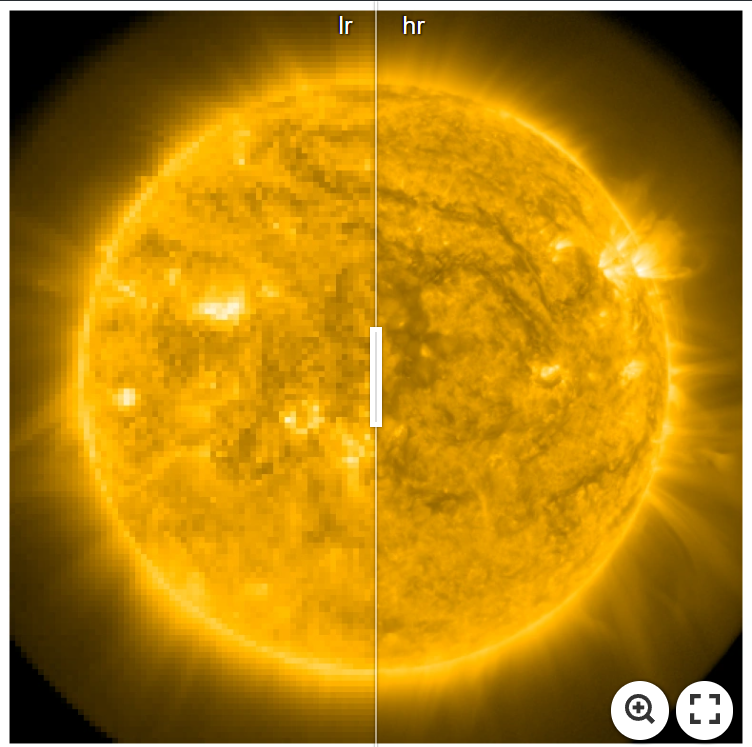

# 🌞 Solar Image Super-Resolution: Deep Learning Architecture Benchmarking

[](https://opensource.org/licenses/MIT)
[](https://www.python.org/downloads/)
[](https://lightning.ai/)

## 🔭 About

This repository implements deep learning architectures for super-resolving solar extreme ultraviolet (EUV) images. The project focuses on enhancing low-resolution solar images using various deep learning approaches including CNNs, GANs, and Diffusion Models.

## 🏗️ Repository Structure

```
📦 base/
├── 📁 src/                          # Core source code
│   ├── 📁 rrdb/                     # RRDB implementation
│   ├── 📁 gan/                      # GAN implementation  
│   ├── 📁 ldm/                      # Latent Diffusion Models
│   ├── 📄 datamodule.py             # PyTorch Lightning data handling
│   ├── 📄 metrics.py                # Evaluation metrics
│   └── 📄 callbacks.py              # Training callbacks
├── 📁 vanilla/                      # Alternative implementations
│   ├── 📄 trainer.py                # Custom training logic
│   ├── 📄 vae.py                    # VAE implementation
│   ├── 📄 rrdb.py                   # RRDB implementation
│   ├── 📄 datamodule.py             # Data handling
│   └── 📄 callbacks.py              # Training callbacks
├── 📁 configs/                      # Configuration files
│   ├── 📁 models/                   # Model-specific configurations
│   │   ├── 📄 rrdb.yml              # RRDB configuration
│   │   ├── 📄 esrgan.yml            # ESRGAN configuration  
│   │   ├── 📄 vae.yml               # VAE configuration
│   │   ├── 📄 ldm.yml               # LDM configuration
│   │   └── 📄 eldm.yml              # ELDM configuration
│   └── 📄 config.yml                # Base configuration
├── 📁 figs/                         # Image assets
│   ├── 📄 half.png                  # Comparison image
│   ├── 📄 comparison.png            # Results comparison
│   ├── 📄 lr.png                    # Low resolution sample
│   └── 📄 right3.png                # High resolution sample
├── 📄 train.py                      # Training script
├── 📄 inference.py                  # Inference script
├── 📄 requirements.txt              # Python dependencies
└── 📄 README.md                     # This file
```

## 🚀 Quick Start

### Prerequisites
- Python 3.8+
- CUDA-compatible GPU (recommended)

### Installation

```bash
# Clone the repository
git clone https://github.com/kahirhumibntwerag/base.git
cd base

# Install dependencies
pip install -r requirements.txt
```

## 🎯 Training

### Available Models
The repository supports training the following architectures:
- **RRDB**: Residual-in-Residual Dense Block network
- **ESRGAN**: Enhanced Super-Resolution GAN
- **VAE**: Variational Autoencoder
- **LDM**: Latent Diffusion Model
- **ELDM**: Enhanced Latent Diffusion Model

### Training Commands

```bash
# Train RRDB model
python train.py --model_name rrdb

# Train ESRGAN model  
python train.py --model_name esrgan

# Train VAE model
python train.py --model_name vae

# Train LDM model
python train.py --model_name ldm

# Override configuration parameters
python train.py --model_name rrdb --opt trainer.max_epochs=100 model.learning_rate=1e-4
```

### Configuration System
The project uses a hierarchical configuration system:
1. **Base config** (`configs/config.yml`): Common settings
2. **Model-specific configs** (`configs/models/*.yml`): Architecture-specific parameters  
3. **Command-line overrides**: Dynamic parameter adjustment using `--opt`

## 🔬 Inference

```bash
# Run inference (specific usage depends on inference.py implementation)
python inference.py --model_name <model_name> --checkpoint_path <path_to_checkpoint>
```

## 📁 Key Components

### Data Processing (`src/datamodule.py`)
- PyTorch Lightning DataModule for handling solar image datasets
- Supports data loading and preprocessing for training

### Metrics (`src/metrics.py`) 
- Custom evaluation metrics for solar image super-resolution
- Implementation of various image quality metrics

### Callbacks (`src/callbacks.py`)
- Training callbacks including image logging functionality
- Integration with experiment tracking

## 📋 Dependencies

The project requires the following main dependencies:
- PyTorch & PyTorch Lightning
- NumPy, SciPy, Pandas  
- OpenCV, Pillow, scikit-image
- Matplotlib, Seaborn
- SunPy for solar data processing
- Weights & Biases for experiment tracking
- OmegaConf for configuration management

## 📊 Evaluation Metrics

The repository implements the following evaluation metrics:

### Available Metrics
- **PSNR (Peak Signal-to-Noise Ratio)**: Measures pixel-level reconstruction quality
- **SSIM (Structural Similarity Index)**: Measures structural information preservation  
- **SF (Statistical Fidelity)**: Measures statistical distribution consistency of fine-scale details

### Usage
```bash
# Run evaluation with metrics calculation
python inference.py --model_name <model> --model_path <checkpoint> --lr_path <low_res_data> --hr_path <high_res_data>
```

### Benchmark Results

| Model | SSIM ↑ | PSNR (dB) ↑ | SF ↓ | Notes |
|-------|---------|-------------|-------|-------|
| **RRDB** (CNN) | **0.9771** | 39.91 | 0.0192 | Best structural similarity |
| **ESRGAN** (GAN) | 0.9735 | **41.03** | **0.00383** | Best PSNR and statistical fidelity |
| **LDM** | 0.9641 | 37.75 | 0.00749 | Diffusion model baseline |
| **ELDM** (Ours) | 0.9687 | 38.45 | 0.00512 | Enhanced diffusion model |

> **Key Findings**: RRDB achieves the highest structural similarity (SSIM), while ESRGAN provides the best peak signal-to-noise ratio (PSNR) and statistical fidelity (SF). The proposed ELDM model shows competitive performance with improved efficiency over standard LDM.

## 📊 Visual Results

The repository includes sample results in the `figs/` directory:
- Comparison visualizations
- Low and high resolution sample images



*Example comparison showing model performance*


*Performance comparison between different approaches*

## 📚 Citation

```bibtex
@mastersthesis{elsheikh2025solar,
    title={Benchmarking Deep Learning Architectures for Super-Resolution of Solar Images},
    author={Elsheikh, Mohamed Hisham Mahmoud},
    school={[Your Institution]},
    year={2025},
    type={Bachelor's Thesis}
}
```

## 📄 License

This project is licensed under the MIT License.

